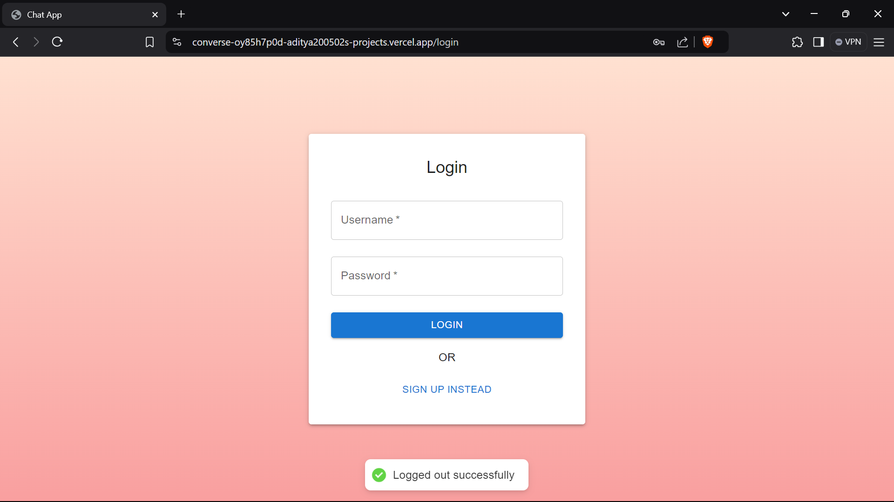
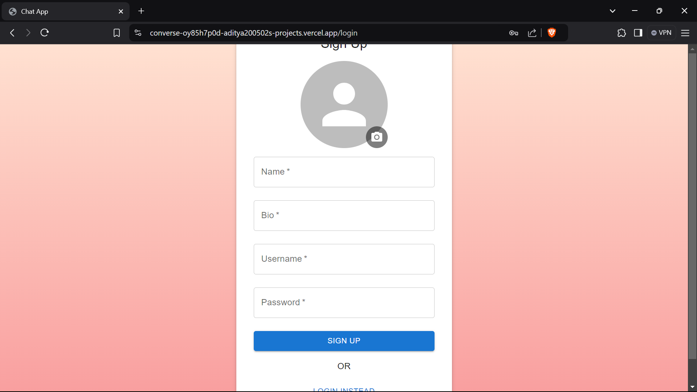
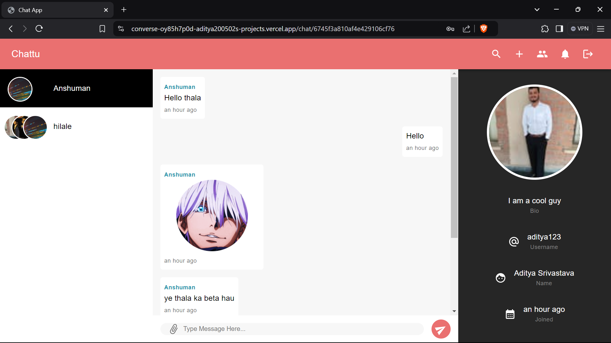
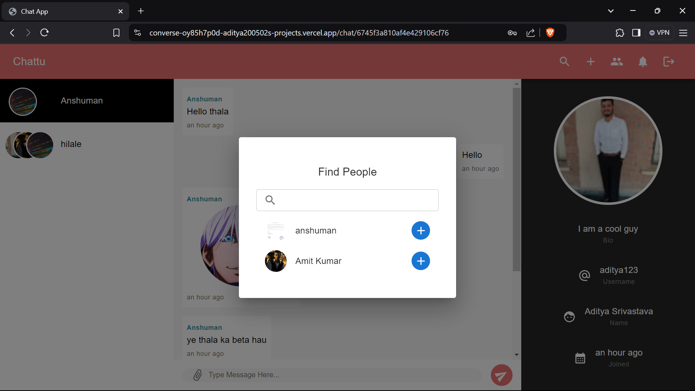
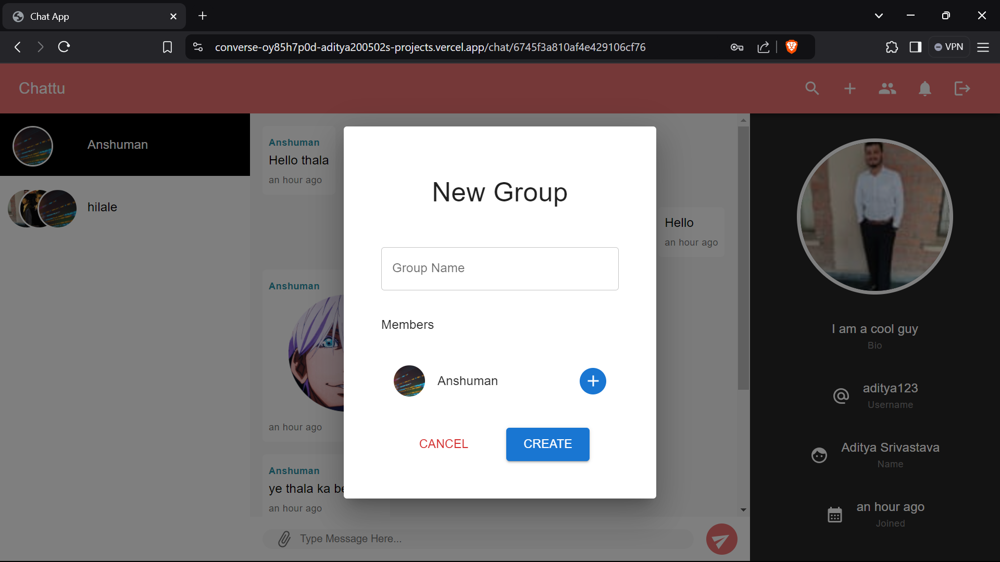
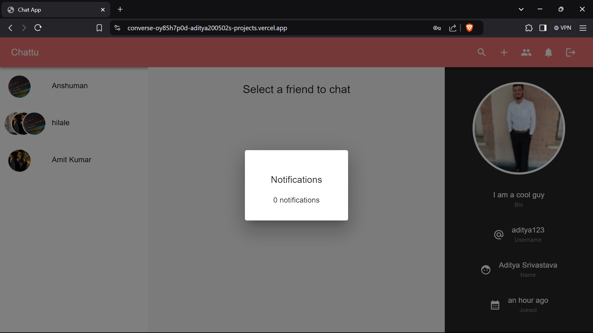

# Converse-Hub 📱💬

A seamless communication platform for real-time messaging, connecting users, and fostering collaboration. 

---

## 🚀 Key Features

### **User Authentication**
- **Sign Up**: Create an account with a unique username and password.
- **Login**: Secure access to your account with credentials.

### **Profile Management**
- **Personalization**: Customize your profile with a name, bio, and profile picture (avatar).

### **Group Chats**
- **Create Groups**: Start group conversations with multiple users.
- **Join Groups**: Search for or receive invites to participate in existing groups.

### **Real-Time Notifications**
- **Instant Alerts**: Get notifications for new messages, group invitations, and mentions.

### **Media Sharing**
- **Image Uploads**: Send images directly in chats for a richer conversation experience.

---

## 🛠️ Getting Started

### **Sign Up**
1. Open the app and click the **"Sign Up"** button.
2. Fill in your username, password, name, and bio.
3. Upload a profile picture.
4. Click **"Sign Up"** to create your account.

### **Login**
1. Enter your registered username and password.
2. Click **"Login"** to access your account.

### **Profile**
- Tap your profile picture to view or edit profile details.

### **Group Chats**
- **Create Groups**: Tap the **"Create Group"** button and add members.
- **Join Groups**: Search for groups or accept invitations.

### **Messaging**
- Search for users or select from your contacts list.
- Start a chat by tapping a user profile.
- Type your message and press **"Send"**.
- Share images using the image icon.

## 🖼️ Screenshots
### Login Screen

### Signup Screen

### HomePage

### Find People

### New Group

### Notifications

## 🧑‍💻 Technical Details

- **Frontend**: ReactJs
- **Backend**: Node.js, ExpressJs
- **Database**: MongoDB
- **Other Tools**: Redux,SocketIo,Thunk,Axios,Multer,Mongoose

---

## 🔒 Security
- Secure authentication and encryption for user data.
- Strict access control to ensure data privacy.

---

## ⚙️ Performance and Accessibility
- **Optimized Performance**: Efficient handling of large group chats.
- **User-Friendly Design**: Easy navigation with a clean interface.
- **Accessibility**: Designed with inclusivity in mind, supporting users with disabilities.

---

## 🌟 Future Features
- Voice and video calls.
- File sharing and document attachments.
- Message reactions and emojis.

---

## 📧 Support
For queries or feedback, contact **[adityasrivastava513@gmail.com]**.

---

Enjoy connecting! 🌐✨
